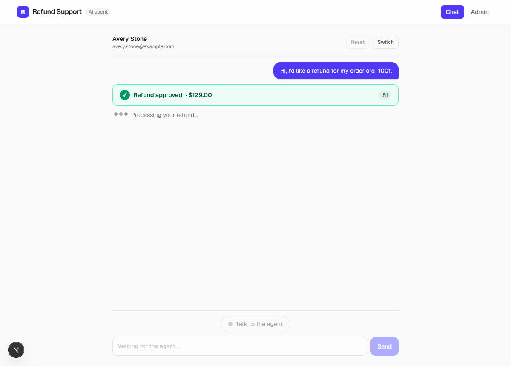
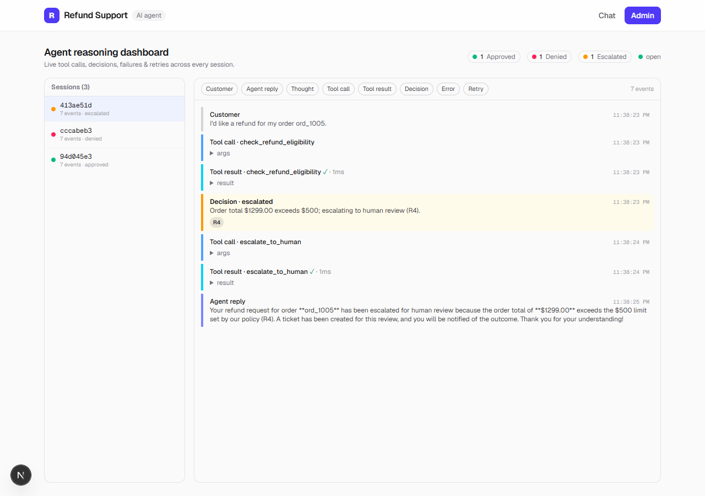
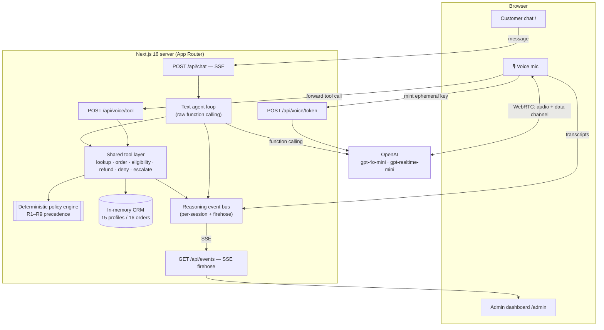

# AI Customer Support Agent

An AI agent that **approves or denies e-commerce refunds** against a strict, numbered refund
policy — over **text chat** and **live voice** (OpenAI Realtime API) — with an **admin dashboard**
that streams the agent's real-time reasoning: tool calls, decisions, failures, and retries.

The money decision lives in **deterministic code**, not the model. The LLM only orchestrates tool
calls; a policy engine (clauses **R1–R9**) decides every refund, and the same six tools power both
the text agent and the voice agent — **tools defined once, two transports.**

|                              Customer chat                              |                         Admin dashboard                         |
| :---------------------------------------------------------------------: | :-------------------------------------------------------------: |
|  |    |

---

## Quick start

```bash
npm install
cp .env.example .env.local        # then edit .env.local: OPENAI_API_KEY=sk-...
npm run dev                       # → http://localhost:3000
```

Open **http://localhost:3000** (customer chat + voice) and **http://localhost:3000/admin**
(reasoning dashboard) side by side. The app loads without a key and shows a helpful banner; the key
is required for the agent to actually reason, reply, and talk.

**Requirements:** Node 20+ and an OpenAI API key with access to `gpt-4o-mini` and the Realtime models
(`gpt-realtime-mini`, `gpt-4o-mini-transcribe`). Voice needs a Chromium-based browser + microphone.

---

## Architecture



### Tools defined once, two transports

The six tools (`lookup_customer`, `get_order_details`, `check_refund_eligibility`, `process_refund`,
`deny_refund`, `escalate_to_human`) are pure, Zod-validated functions in [`lib/tools/`](lib/tools).
A single executor ([`executeTool`](lib/tools/index.ts)) validates I/O and publishes reasoning events.

- The **text agent** ([`lib/agent.ts`](lib/agent.ts)) hands the tools to Chat Completions as function
  schemas (`openaiTools`) and runs the loop server-side.
- The **voice agent** configures its Realtime session with the _same_ schemas (`realtimeTools`, just
  reshaped) and the _same_ system prompt; tool calls the model makes over WebRTC are forwarded by the
  browser to [`/api/voice/tool`](app/api/voice/tool/route.ts) and run through the _same_ `executeTool`.

So a voice refund and a text refund produce identical reasoning events on the same dashboard, and the
policy is enforced identically for both.

### The money decision is code, not the model

`check_refund_eligibility` ([the engine](lib/tools/check-refund-eligibility.ts)) applies the policy's
decision precedence and returns a structured verdict with cited clauses. `process_refund` **re-runs**
that check internally and refuses anything the policy doesn't approve — it takes only a customer +
order id, never a caller-supplied amount. Two independent guarantees make the audit trail complete:

- **Denials/escalations** are emitted by the deterministic engine the moment it reaches a terminal
  verdict (so they're recorded even if the model only speaks the outcome).
- **Approvals** are settled by a turn-end backstop: if the engine approved an order but the model
  didn't call `process_refund`, the loop issues it. Result: **every resolved request yields exactly
  one decision event**, for both transports, regardless of the model's tool-calling variance.

---

## The refund policy (R1–R9)

`data/refund-policy.md` is the single source of truth; `data/customers.json` engineers all 15
profiles to exercise it (`data/refund-scenarios.md` is the oracle). Decision precedence:

| Clause | Rule                                             | Example profile                              |
| ------ | ------------------------------------------------ | -------------------------------------------- |
| **R1** | 30-day return window                             | Avery Stone / ord_1001 → **approve $129**    |
| **R2** | Final-sale items are non-refundable              | Casey Rivera / ord_1003 → **deny**           |
| **R3** | Digital goods are non-refundable                 | Devon Chen / ord_1004 → **deny**             |
| **R4** | Orders > $500 escalate to human review           | Emerson Blake / ord_1005 → **escalate**      |
| **R5** | One refund per order (partial prior → remainder) | Finley Nguyen / ord_1006 → **deny**          |
| **R6** | Identity must match the order owner              | Gray Patel → someone else's order → **deny** |
| **R7** | Damaged/defective: 90-day window (overrides R1)  | Jordan Lee / ord_1010 → **approve**          |
| **R8** | Abuse-flagged accounts go to manual review       | Harper Diaz / ord_1008 → **escalate**        |
| **R9** | Partial refunds (mixed-eligibility orders)       | Kai Robinson / ord_1011 → **partial $70**    |

Dates are stored as **relative offsets** and materialized against a per-session clock, so refund
windows never silently expire regardless of the run date.

---

## Voice pipeline (OpenAI Realtime API over WebRTC)

1. The browser asks [`POST /api/voice/token`](app/api/voice/token/route.ts) for a short-lived
   **ephemeral client secret** (`ek_…`) — the server API key never reaches the browser.
2. It opens a **WebRTC** peer connection and posts its SDP offer to
   `https://api.openai.com/v1/realtime/calls` authorized by that key.
3. Mic audio streams up; the agent's audio streams down and plays. A data channel carries Realtime
   events. Both sides' transcripts render as spoken chat bubbles **and** post to the event bus, so
   voice sessions appear on the admin dashboard exactly like text ones.
4. The Realtime session is configured with the same tools + policy prompt; tool calls execute
   server-side. Model: `gpt-realtime-mini`; input transcription: `gpt-4o-mini-transcribe`.

Every failure mode degrades gracefully to text chat: unsupported browser, blocked mic, token error,
or a dropped connection (with a grace period for transient ICE blips).

---

## Testing

```bash
npm test            # 171 Vitest unit/integration tests (offline; mock-completer seam)
npm run evals       # scenario evals through the REAL agent (needs OPENAI_API_KEY)
npm run evals 3     # 3 consecutive runs — the Step-9 "holding the line" exit criterion
```

- **Unit/integration** (`tests/`, 171 tests) cover the policy engine against every profile, the tool
  guards, the SSE + API layer, the agent loop, the UI, the admin dashboard, and the voice pipeline —
  all offline via an injectable completer / mocked `EventSource` / `RTCPeerConnection`.
- **Evals** (`lib/evals/`, `scripts/evals.mts`) run full conversations through real `gpt-4o-mini` and
  assert on the emitted **decision events**: 16 policy baselines + a 7-scenario red-team suite (prompt
  injection, policy gaslighting, emotional manipulation, fake-authority override, split-request,
  cross-customer fishing, multi-turn wear-down), verifying the agent never approves under pressure and
  never leaks another customer's data.
- **Real-API smokes** (`scripts/smoke-*.mts`, `scripts/*-check.mts`) validate the live OpenAI wiring
  and the browser flows (Playwright + system Chrome).

---

## Scripts

| Script                       | Purpose                                                    |
| ---------------------------- | ---------------------------------------------------------- |
| `npm run dev`                | Dev server (Turbopack) → http://localhost:3000            |
| `npm run build` / `start`    | Production build & serve                                  |
| `npm test` / `test:watch`    | Vitest (one-shot / watch)                                 |
| `npm run evals [N]`          | Scenario evals through the real agent (optionally N runs) |
| `npm run lint` / `typecheck` | ESLint (flat config) / `tsc --noEmit`                     |
| `npm run format[:check]`     | Prettier write / verify                                   |

## Project layout

```
app/            routes: / (chat+voice), /admin, /api/{chat,events,session,reset}, /api/voice/{token,tool,transcript}
components/     chat/ · voice/ · admin/  (React UI)
lib/            agent.ts (text loop) · tools/ (6 tools + engine) · events.ts + event-bus.ts
                db.ts (CRM + policy engine data access) · voice/token.ts · client/ (browser: api, sse, voice)
                evals/ (scenario battery + runner)
data/           customers.json (15 profiles) · refund-policy.md · refund-scenarios.md (oracle)
tests/          Vitest suites (offline)   scripts/  eval harness + real-API smokes
```

## Environment

| Variable         | Required | Notes                                                           |
| ---------------- | -------- | --------------------------------------------------------------- |
| `OPENAI_API_KEY` | yes\*    | Server-only (never `NEXT_PUBLIC_`); lives in `.env.local` only. |

\* The app runs and renders without it (shows a setup banner); it's required for any agent reasoning,
reply, or voice. Model names are centralized in [`lib/config.ts`](lib/config.ts) — all mini-tier per
the project's cost guard.

See **[DEMO_SCRIPT.md](DEMO_SCRIPT.md)** for a timed 7–10 minute walkthrough.
